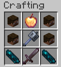

# WeaponsPlugin

A custom Minecraft Spigot/Paper (1.21) plugin that adds unique, powerful weapons obtained through immersive rituals.

## Features

### Custom Weapons
Each weapon has unique abilities and textures (via CustomModelData).

- **Scythe of Light** (Mace)
  - *Attributes*: 8 Attack Damage, 1.6 Attack Speed (Sword-like stats).
  - *Ability*: **Holy Smash**. Deals increased damage when falling (Native Mace mechanic).
  - *Passive*: Sparkle effects on hit.
- **Scythe of Darkness** (Netherite Axe)
  - *Ability*: **Dark Wave** (Right-click). Launches a wave of shadow particles that damages enemies and transfers your potion effects to them. Costs 25% health.
  - *Passive*: **Reap**. Pulls enemies towards you on hit.
- **Wither Launcher** (Crossbow)
  - *Ability*: **Wither Shot**. Launches a non-destructive Wither Skull.
  - *Effect*: Applies Wither II to targets on impact.
- **Lifestealer** (Netherite Sword)
  - *Passive*: Heals wielder for 50% of damage dealt.
  - *Ability*: **Blood Shield** (Right-click). Grants high Absorption for 60s.
- **King's Crown** (Netherite Helmet)
  - *Passive*: Unbreakable.
  - *Ability*: **Bounty**. Allows the wearer to set bounties.

### Ultra Legendary Weapon

- **Kusanagi** (Netherite Sword)
  - *Attributes*: 15 Attack Damage, 1.8 Attack Speed.
  - *Passive*: 100% lifesteal, Lightning strike on hit (5% chance), Fire Aspect, Fortune III.
  - *Ability*: **Thunder Storm** (Right-click). Calls lightning on all enemies within 30 blocks.
  - *Cooldown*: 2 minutes

### Ultra Guardian Boss

The **Ultra Guardian** is a powerful Wither boss that spawns 700+ blocks away from the nearest player. When killed, it drops the **Kusanagi**.

- Spawn command: `/spawnboss` (OP only)
- Health: 500 HP
- Damage: 25 per hit
- Location: Random spawn, minimum 700 blocks from any player

### Crafting the Kusanagi

To craft the Kusanagi, you must:
1. Kill the Ultra Guardian to obtain the Kusanagi (it drops on death)
2. **OR** craft it using a ritual-like process:
   - Must be within **700 blocks** of the Ultra Guardian
   - Must use a **legendary weapon** in the crafting grid
   - The legendary weapon is **consumed** and can no longer be used to craft another Kusanagi
   - Recipe: Lightning Rod, Netherite Sword, Nether Star, Echo Shard

### Ritual System
Weapons are not crafted normally but created through a **Ritual**.
- **Usage**: `/ritual <item_id>` (OP only).
- **Process**:
  - The ritual builds a structure (Beacon + Spruce) and plays effects over time.
  - **Global Messages**: The entire server is notified when a ritual starts and completes.
- **Unique Limit**: Each weapon is **unique**. It can only be crafted once per server history unless destroyed.

### Destruction & Recovery
If a Legendary Weapon is lost, it can be crafted again.
- **Destruction Detection**:
  - Dropped in **Lava/Fire/Void**.
  - Destroyed by **Explosion**.
  - Player dies in the **Void**.
- **Effect**: A global message announces the destruction of the ancient weapon, and it is automatically unmarked from the registry, allowing a new ritual to start.

## Crafting Recipes

### Scythe of Light


### Scythe of Darkness


### Wither Launcher


### Lifestealer


### King's Crown


### Kusanagi
```
L X L
L N L
S L S

L = Lightning Rod
X = Netherite Sword
N = Nether Star
S = Echo Shard
```

*Note: Kusanagi can only be crafted within 700 blocks of the Ultra Guardian boss.*

## Commands

- `/ritual <item_id>` - Start a ritual to create a weapon (OP only).
  - IDs: `scythe_of_light`, `scythe_of_darkness`, `wither_launcher`, `lifestealer`, `kings_crown`.
- `/weapon reset` - Resets all "crafted" flags (OP only).
- `/bounty <player>` - Place a bounty on a player (crown wearer only).
- `/spawnboss` - Spawn the Ultra Guardian boss (OP only).

## Installation
1. Drop the jar into your server's `plugins` folder.
2. Restart the server.
3. Ensure you are running **Minecraft 1.21+**.

## Permissions
- `weapons.waiting` (Default: OP) - Required for commands.

## Building
```bash
mvn clean package
```